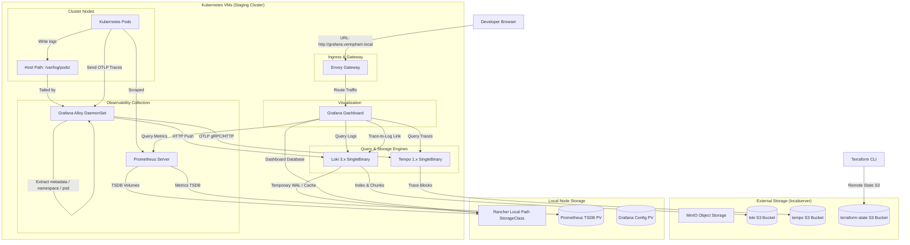

# Kubernetes Observability Architecture (LGTM Stack & MinIO)

This document provides the complete architectural design, component configurations, and data lifecycle management for the self-hosted **LGTM Stack** (Loki, Grafana, Tempo, Grafana Alloy, and Prometheus) deployed in your staging Kubernetes cluster.

---

## 1. System Architecture Diagram

Below is the visual flow of metrics, logs, and traces from the cluster nodes to the visualization layer and S3 storage:

---

## 2. Component Configurations

### A. Grafana Loki 3.x (Log Aggregation)
* **Deployment Mode:** Monolithic (`SingleBinary`), running as a single replica StatefulSet (`loki-0`).
* **Replication Factor:** Set to `1` (`replication_factor = 1`) to optimize Loki for single-replica local deployments and prevent quorum/timeout locks.
* **Storage backend:** MinIO S3 bucket `loki` endpoint `192.168.1.223:9000`. Both indexes (TSDB format) and log chunk binaries are consolidated and stored natively inside the same S3 bucket.
* **Log Retention Policy:**
  * **Global Limit:** Set to **3 days** (`retention_period = 72h`).
  * **Engine:** Compactor is enabled (`retention_enabled = true`) to run automatic purge routines.
  * **Delete Marker Storage:** Configured to use S3 (`delete_request_store = s3`) to record deletion transactions securely.

### B. Grafana Tempo 1.x (Distributed Tracing)
* **Deployment Mode:** Monolithic (`SingleBinary`), running as a single replica StatefulSet (`tempo-0`).
* **Storage backend:** MinIO S3 bucket `tempo` endpoint `192.168.1.223:9000`. Traces are stored as block objects directly on S3.

### C. Prometheus Server (Metrics Engine)
* **Deployment Mode:** Standalone Prometheus Server using a local Persistent Volume (PV).
* **Alertmanager & Pushgateway:** Alertmanager is disabled to keep resource overhead minimal in the homelab environment.
* **Storage Allocation:** Persistent volume claim size is `10Gi` backed by the Rancher Local Path storage class.
* **Retention:** Configured to keep metrics for **15 days** (`retention = 15d`).

### D. Grafana Alloy (Observability Collector)
* **Deployment Mode:** DaemonSet running on every cluster node.
* **Privileged Access:** Configured to run as root (`runAsUser = 0`) to bypass permission limits when reading hostpath logs under `/var/log/pods/`.
* **Log Tailer & Metadata Relabeling:**
  * Discovers all log files matching `/var/log/pods/**/*.log`.
  * Custom `discovery.relabel` rules automatically extract Kubernetes metadata directly from the log file directory structure `/var/log/pods/<namespace>_<pod>_<uid>/<container>/*.log` and apply:
    * `namespace`
    * `pod`
    * `container`
    * `job` (mapped as `namespace/container`)
  * Forwards labeled logs to Loki via `/loki/api/v1/push`.
* **Tracing Collector:** Exposes OTLP gRPC (port `4317`) and HTTP (port `4318`) receivers inside the cluster, batching trace spans before exporting them to Tempo.

### E. Grafana (Dashboard Visualizer)
* **Storage:** Persistent config database (`10Gi`) to preserve settings and custom dashboards.
* **HTTP Routing:** Expose gateway routes via an Envoy Gateway `HTTPRoute` mapped to `http://grafana.vennpham.local`.
* **Datasources:**
  * **Prometheus:** Connected to `http://prometheus-server:80`.
  * **Tempo:** Connected to `http://tempo:3100` (UID: `tempo`).
  * **Loki:** Connected to `http://loki:3100` (Set as default datasource).
* **Correlation (Logs-to-Traces Link):** Loki datasource is configured with a custom `derivedField` pointing to Tempo. Whenever a log line contains a Trace ID pattern (`traceID=(\w+)`), Grafana displays it as a clickable blue link that opens the corresponding Tempo trace Gantt chart side-by-side.

---

## 3. Storage Provisioning

* **Dynamic local volumes:** Rancher **Local Path Provisioner** is deployed via upstream manifests and acts as the default storage class (`local-path`).
* **Volume bindings:** When Grafana, Prometheus, or Loki request a PersistentVolumeClaim, the provisioner automatically mounts and binds local host directories on the host node (`/opt/local-path-provisioner`), unblocking disk allocation.

---

## 4. Terraform Infrastructure Management

* **Remote State:** Both the cluster provisioner (`stg`) and the add-ons installer (`stg-add-ons`) store their state records (`.tfstate`) in your MinIO S3 bucket `terraform-state`.
* **AWS STS Bypass:** Configured with `skip_requesting_account_id = true` to allow Terraform's S3 backend to operate on your private MinIO server without failing on AWS credentials/account lookups.
* **Auto-import Blocks:** Staging add-ons code uses native `import` blocks to automatically import pre-existing resources (namespaces and Helm releases) into the state, preventing conflicts during updates.
